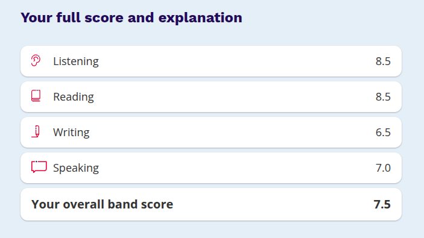

# **A Comprehensive Guide to IELTS from Bangladesh's Perspective.**

Firstly, I registered from FutureEd. The reason was nothing special. Their mock venue and main test venue will be the same, so it was a chance to familiarize myself with the venue.

About the registration fee, it's on the rise. I did not take any extra course or mock.

**I took 6 or 7 hours of preparation. But that is me. Take proper preparation.**

Now let's talk preparation module by module.

# Listening

This is a concentration game. The audio quality is really great. I don't think I even watched any videos for it. I just gave some mocks on IOT. The only place you may struggle is typing while listening. Be careful about spelling. In the real exam, you will be able to flag any question if you want. Use it. Practise, practise, practise!

# Reading

Cannot recall if I watched any videos for it. If I did, then it was definitely IELTS Advantage. Very good channel.

I have seen people struggling with it. Start practising. Do not just see your marks. Try to find the pattern of what you are struggling with. Give more concentration to that. Be careful of the spelling.

I struggled with headings and False/Not Given. For headings, do not look at the options. Read a passage and try to come up with a heading in your head. Then go to the options.

For False/Not Given, the questions in the real exam are consecutive from the passage. So read them and see if the information in the next question is something you have already reached.

# Speaking

I fumbled it myself. In my mock, I was told I deserved a 9 and, if anything terrible happened on test day, I would score 7.5 at the lowest. So naturally, I took zero preparation for it. Watched like 3/4 reels lol.

So there is a misconception here. They will not ask you about your favourite book or movie. It will be something obscure. Like, for Task 2, it could be something like: "Talk about your favourite freaking tall building." That's exactly what I was asked for Task 2. After making up shit for 2 minutes, my follow-up question was, "Do your friends agree with your views about this building?" I was already in a bad mood and said, "I don't think I have ever had any conversation about buildings with my friends. This is a very boring topic." ;-(

One thing that might help is recording yourself talking and listening to it. It will be cringy, but you will get to know what you are doing wrong. Do not give too much of a fuck about grammar.

For Task 1, the questions were also something like, "What clothes do you like?" blah blah. So overall, I had a bad experience. I took the video call option. Mine was probably an Irish or a British guy.

# Writing

Disappointed about it. Practise as much as possible. Watch videos from IELTS Advantage. They want a particular way of writing. Complex and compound sentences, passive voice etc.. Give all your writing to 1 chat and, before exam day, tell the LLM to make you a PDF of common grammatical mistakes that you keep making, the spelling mistakes, the vocabulary that you need, and how to proofread after writing.

# About Mock Tests

Do not get scared after seeing your mock results for LRW. Those mocks are designed to be harder than the real test so that they can get your money. In the real exam, if you do not fuck it up real bad, you will get at least 1 or .5 more band.

Try to finish R and W in half of the time. 30 minutes max.

# On exam day

Relax, No need to take it seriously. Do not think about thr huge money that you paid or what if you score bad. It is easy to say it but please stay comfortable. Do not take pressure. Adjust your seat height, monitor-keyboard position.

# **Links**

- [IELTS Advantage — YouTube](https://www.youtube.com/@Ieltsadvantage)
- [IELTS Online Tests](https://ieltsonlinetests.com/)

**If it comes to any help, feed some stray cats and dogs for me and feel hesitant to knock me.**

